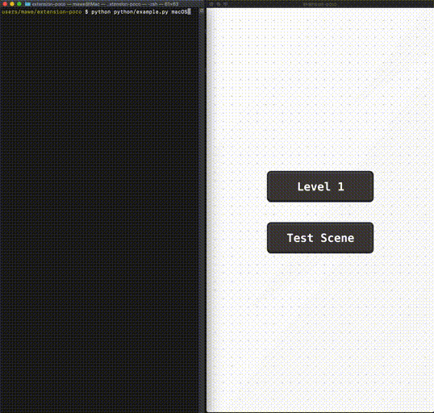

# Poco test framework integration

## About

`extension-poco` is a native extension for [Defold](https://www.defold.com) to enable test automation from a computer to a test device (desktop or mobile).

This extension implements the [Poco](https://poco-chinese.readthedocs.io/en/latest/#) api, using the [Cocos2Dx-lua](https://poco-chinese.readthedocs.io/en/latest/source/doc/integration.html?highlight=cocos2d#cocos2dx-lua) Lua server, with some small cusomization on top (see `defold-poco.lua`)

## Installation

### Defold
To use this library in your Defold project, add the following URL to your `game.project` dependencies:

https://github.com/defold/extension-poco/archive/master.zip

We recommend using a link to a zip file of a [specific release](https://github.com/defold/extension-poco/releases).

### Python

The Poco api is compatible with both Python 2.7 and Python 3.3-3.6.

### Poco library

Install the Poco library (from [documentation](https://poco-chinese.readthedocs.io/en/latest/source/README.html#installation)):

    pip install pocoui

## Usage - Game side

### Server

See [main.script](./main/main.script) for an example.

Note that you can also use this in the `gui` script context as well.

Add a require to one of your Defold scripts

    local poco = require('poco.lua.defold-poco')

Create a PocoManager instance at game startup:

    function init(self)
        poco:init_server(15004) -- default port for Poco
    end

Update the PocoManager instance continuously:

    function update(self, dt)
        poco:server_loop()
    end

You also need to set the view projection matrices (e.g. on resize event).
The default values are the identity matrix.

    poco:set_view_proj(get_view_proj()) -- view projection matrix from render script
    poco:set_gui_view_proj(get_gui_view_proj()) -- view projection matrix from render script

Here's an example using [rendercam](https://github.com/rgrams/rendercam):

    local rendercam = require "rendercam.rendercam"

    local function get_view_proj()
        local view = rendercam.calculate_view()
        local proj = rendercam.calculate_proj()
        return proj * view
    end

    local function get_gui_view_proj()
        local mat = vmath.matrix4_orthographic(0, rendercam.window.x, 0, rendercam.window.y, -1, 1)
        return mat
    end

### Custom function

You can add a custom function that you can call from the client scripts:

Server:

    poco:set_dispatch_fn("TestNewFunction", function(x, y, z)
            print("INSIDE NEW CLIENT TEST FUNCTION!", x, y, z)
            return {message= "" .. (x + y + z)}
        end)

Client:

    cbk = poco.agent.rpc.call("TestNewFunction", 1, 2, 3)
    cbk.wait()

## Custom hook

You can also add a hook to an existing function, in order to manipulate the result before it's returned to the client.

    poco:set_dispatch_callback_fn("Dump", function(scene)
        pprint("INSIDE NEW CALLBACK FUNCTION!", scene)
        return scene
    end)

## Usage - Client side (i.e. the Python test script)

### Setup

If you're using a predefined ipaddress, you can use a `VirtualDevice`:

    device = VirtualDevice(ipaddress)

You create a `StdPoco` instance using an `ip address` and a `port`:

    poco = StdPoco(addr=(ipaddress, port), device=device, use_airtest_input=False)

If you are using Android, you don't know the ipaddress of the device, you can use a `device = None` and ipaddress 0 `0.0.0.0`.

The default port for the poco server in the extension is `15004`

See the [examples](https://github.com/defold/extension-poco/tree/master/examples) for practical examples of how to create a Poco instance.

### Dump the scene graph

You can get the full scene graph:

    ui = poco.agent.hierarchy.dump()

### Click on an object

To click on an object named `button_node`:

    poco("button_node").click()

### Send key text combination

Special keys are of the format `{KEY_name}`.
Other characters are treated as text. (NOTE: Currently no unicode support)

    poco.agent.input.keyevent('test@mail.coo{KEY_BACKSPACE}m')

### Examples
[Examples](https://github.com/defold/extension-poco/tree/master/examples)

This extension also contains a test project, which we can test against.

Launch the test project on your device and then run one of the [test scripts](https://github.com/defold/extension-poco/tree/master/examples).

How to test against a local build on the host computer:

    $ python2 ./examples/example_dump.py

Connect to a certain ip (any device type):

    $ python2 ./examples/example_dump.py -a <ip address>

Connect to an Android device via `adb` (if you don't know its ipaddress)

    $ python2 ./examples/example_dump.py -p android

For list of all arguments:

    $ python2 ./examples/example_dump.py -h

### Poco Documentation

There are several resources on how to write a test script here:

* [AirTestProject/Poco](https://github.com/AirtestProject/Poco/blob/master/README.rst)

* [Poco - Examples and Tutorials](https://poco.readthedocs.io/en/latest/source/doc/poco-example/index.html#tutorial)

### Caveats

While the Defold scene graph inspection api strives to reconstruct the scene as it once was in the Defold Editor, it is not possible to accurately do so to 100%. Some of the data is not avaiable once in runtime format.

Each component type also has to implement its own hooks into the inspection api, so if the component type you're looking for isn't seen in the output graph, this might be the reason.

